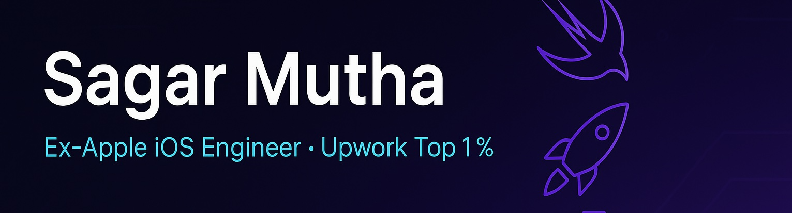

<!-- Banner → create a simple 1110×280 image and drop it in /assets -->

  

<h3 align="center">Ex-Apple iOS Engineer • Upwork Top 1 % • 50 + Apps Shipped</h3>

  <a href="https://www.linkedin.com/in/sagar-mutha/">LinkedIn</a> •
  <a href="https://www.upwork.com/freelancers/sagarios">Upwork</a> •
  <a href="mailto:sagar@thebrewapps.com">Email</a> •
  <a href="https://calendly.com/meet-with-sagar/halfhour">Book a Call</a>

---

## 👋  Hey, I’m Sagar

* Ex-Apple engineer turned founder of **BrewApps**  
* **Expert-Vetted** on Upwork (top 1 %) with 10 + years in mobile  
* Built **50 + production apps**—> 10 M downloads and counting  
* Love fast releases, clean code, and clear comms

---

## 🛠  What I Build

| Area | Typical wins |
|------|--------------|
| **iOS subscription apps** | ≤ 6-week MVPs, App Store compliance day 1 |
| **Cross-platform** (Flutter, React Native) | One codebase, half the budget |
| **Backend & automations** (Node, Supabase, AWS) | Ship features weekly, not quarterly |
| **Gen-AI & analytics** | Autocapture events, AI-driven UX tweaks |

---

## 🚀  Featured Work (quick peek)

| Project | Snapshot | Impact |
|---------|----------|--------|
| **Record Phone Calls** |  | Grew to \$35 k / mo MRR in 9 months |
| **MinuteWise AI Notes** |  | 4.8⭐ rating, cut meeting minutes prep by 70 % |
| **Roast AI** |  | #3 on Product Hunt, 40 k users first week |

*(Replace GIFs & numbers with your own.)*

---

## 🔧  Tech Toolbox

---

## 📊  GitHub Snapshot

  
  

---

## 💌  Let’s Talk

**Got an idea or a stuck roadmap?**  
Drop me a line at **sagar@brewapps.ai** or DM on [Upwork](https://www.upwork.com/freelancers/~sagarMutha).  
I reply within 24 h—usually with a quick loom of how I’d tackle it.

---

Currently ⭐ 185 across 23 public repos (aiming for 500 ⭐ this year). Thanks for stopping by!
